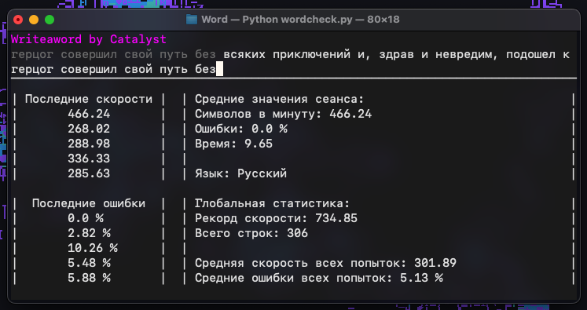

# Write a word
Приложение для проверки скорости печати.

В приложении есть 3 режима набора текста
* Русский
* Анлийский
* Цифры (или же numline)

Для каждого режима ведётся статистика скоростей и ошибок, а также глобальная статистика за всё время

## Дополнения
Все тексты могут быть найдены в файлах `ru-text.txt`, `en-text.txt`, `nl-text.txt`, допускается расширение этих текстов, только каждый набор должен находится в одной строке. 
Скрипт `numline-generator.py` генерирует новый набор строк для набора цифр. 

## Заметка
Код старый, так что выглядит совершенно уродливо и нечитаемо. Но он работает.
